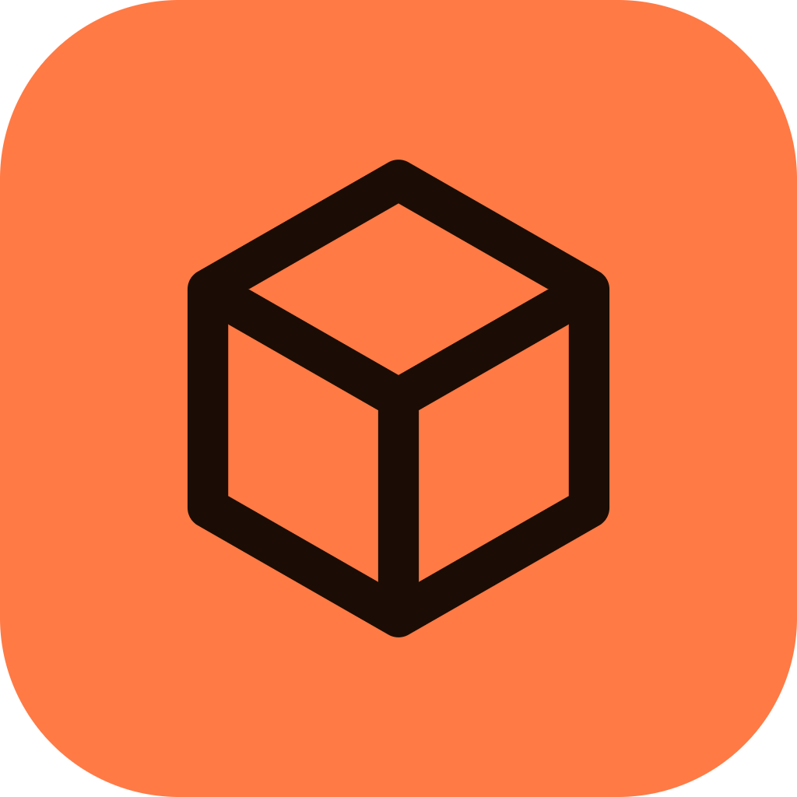
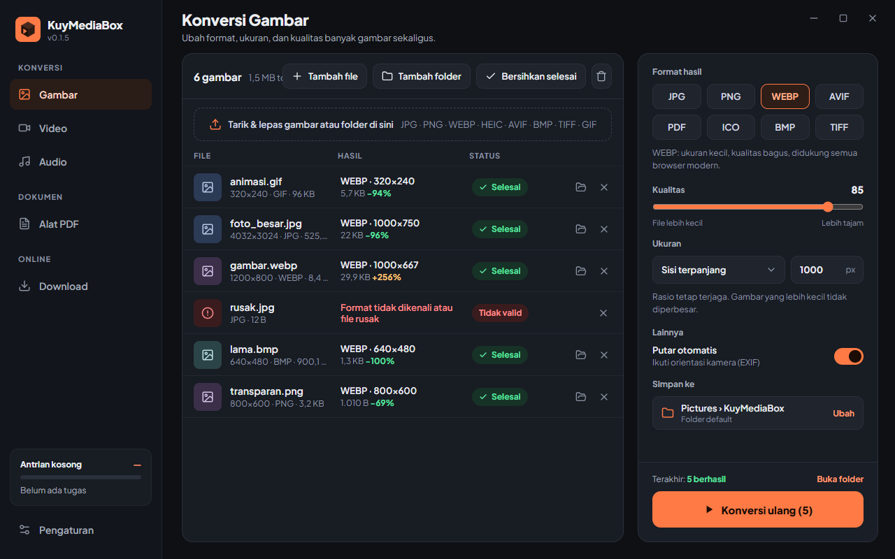
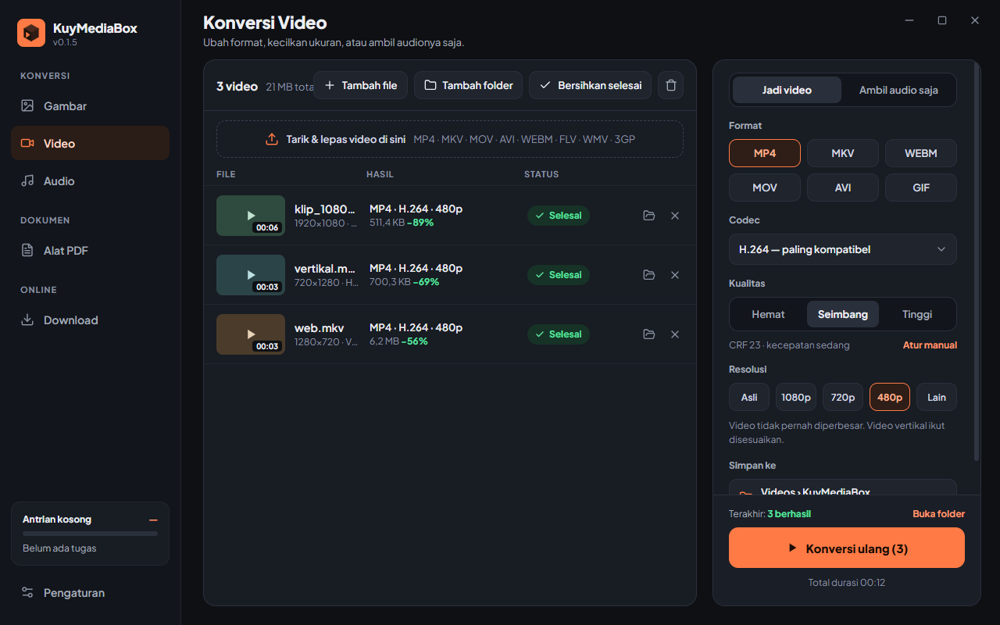
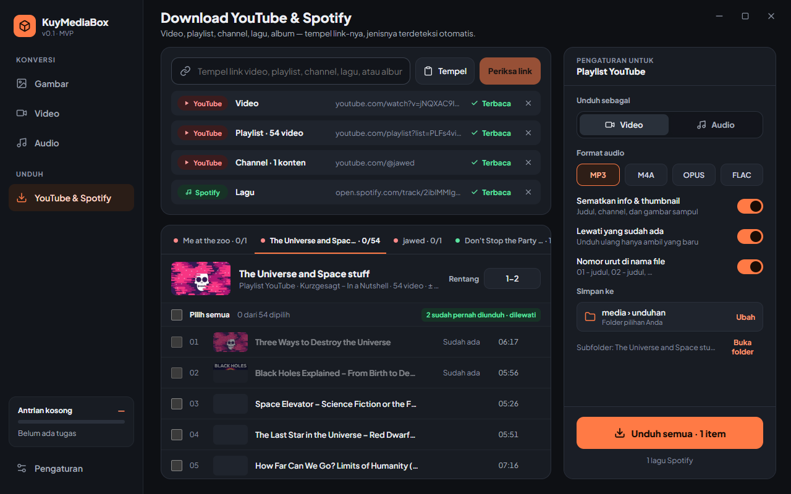
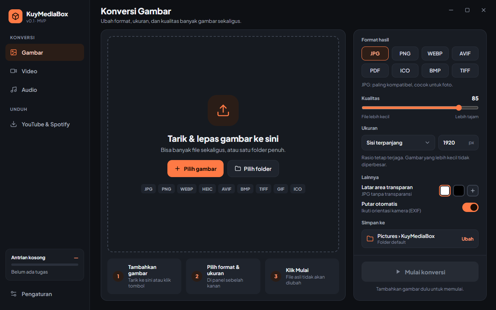

<div align="center">



# KuyMediaBox

**Satu aplikasi desktop untuk konversi gambar, video, audio, dan download YouTube & Spotify.**
Ringan, offline, tanpa iklan, dan tanpa batas ukuran file.

[](https://github.com/iqbalfaf/KuyMediaBox/releases/latest)


</div>



---

## Daftar isi

- [Download](#-download)
- [Fitur](#-fitur)
- [Cara penggunaan](#-cara-penggunaan)
- [Tutorial build dari source](#-tutorial-build-dari-source)
- [Membuat release di GitHub](#-membuat-release-di-github)
- [Lokasi data & file](#-lokasi-data--file)
- [Troubleshooting](#-troubleshooting)
- [Struktur project](#-struktur-project)

---

## ⬇ Download

Program yang sudah jadi tersedia di halaman **[Releases](https://github.com/iqbalfaf/KuyMediaBox/releases/latest)**:

| File | Untuk |
|---|---|
| `KuyMediaBox-vX.Y.Z-windows-x64-setup.exe` | **Installer**: membuat shortcut Desktop & Start Menu, bisa di-uninstall dari Settings Windows |
| `KuyMediaBox-vX.Y.Z-windows-x64-portable.exe` | **Portable**: langsung jalan tanpa instal (bisa disimpan di flashdisk) |
| `KuyMediaBox-vX.Y.Z-windows-x64-portable.zip` | Versi portable dalam bentuk zip |
| `SHA256SUMS.txt` | Checksum untuk memastikan file tidak rusak/diubah |

**Kebutuhan sistem:** Windows 10/11 64-bit dengan WebView2 Runtime (sudah bawaan Windows 11 dan Windows 10 yang ter-update; installer akan memasangnya bila belum ada).

> Saat pertama dibuka, buka **Pengaturan › Tools pendukung** lalu klik **Unduh** untuk FFmpeg, yt-dlp, dan spotDL. Cukup sekali. Aplikasinya sendiri berukuran ±20 MB; tools tersebut diunduh terpisah agar selalu versi terbaru.

---

## ✨ Fitur

### 🖼 Konversi Gambar

| | |
|---|---|
| **Input** | JPG, JPEG, JFIF, PNG, WEBP, GIF, BMP, TIFF, **HEIC/HEIF** (foto iPhone), AVIF, ICO. Format lain dicoba lewat FFmpeg. |
| **Output** | JPG, PNG, WEBP, AVIF, PDF, ICO, BMP, TIFF |
| **Kualitas** | Slider 1–100 untuk JPG, WEBP, AVIF, dan PDF |
| **Ukuran** | Ukuran asli · sisi terpanjang (px) · persentase · lebar × tinggi maksimal. Rasio selalu terjaga, gambar kecil **tidak pernah diperbesar**. |
| **Transparansi** | Untuk format tanpa transparansi (JPG/BMP/PDF), area transparan diisi putih, hitam, atau warna pilihan |
| **Putar otomatis** | Mengikuti orientasi kamera (EXIF), jadi foto tidak miring |
| **ICO** | Otomatis dibatasi 256×256 px (ukuran ikon Windows) |
| **Info hasil** | Ukuran file hasil dan persentase penghematan (mis. `−82%`) per file |

### 🎬 Konversi Video

| | |
|---|---|
| **Input** | MP4, MKV, MOV, AVI, WEBM, FLV, WMV, 3GP, TS, M4V, MPG, MPEG, MTS, M2TS, OGV, VOB |
| **Output** | MP4, MKV, WEBM, MOV, AVI, **GIF** |
| **Codec** | H.264 (paling kompatibel), H.265 (lebih kecil), VP9, AV1, dan **Salin tanpa encode ulang** (super cepat, tanpa turun kualitas). Hanya codec yang cocok dengan format & tersedia di FFmpeg yang bisa dipilih. |
| **Kualitas** | Pilihan mudah: Hemat / Seimbang / Tinggi, atau **Atur manual** (CRF + kecepatan encode) |
| **Resolusi** | Asli, 1080p, 720p, 480p, atau custom. Video vertikal ikut disesuaikan dan tidak pernah diperbesar. |
| **GIF** | 12 fps dengan palet warna optimal, cocok untuk klip pendek |
| **Ambil audio saja** | Ekstrak audio dari video ke MP3, M4A, FLAC, WAV, OGG, atau OPUS |
| **Info media** | Resolusi, codec, fps, durasi, dan ukuran dibaca otomatis (ffprobe) |
| **Progress** | Persen per file, kecepatan encode (mis. `2.1x`), dan estimasi sisa waktu |

### 🎵 Konversi Audio

| | |
|---|---|
| **Input** | MP3, WAV, FLAC, AAC, M4A, OGG, OPUS, WMA, AIFF, AMR, APE, WV, MKA, dan **audio dari file video** |
| **Output** | MP3, M4A (AAC), FLAC, WAV, OGG, OPUS |
| **Bitrate** | 128 / 192 / 256 / 320 kbps (Opus: 96–256 kbps). FLAC & WAV lossless. |
| **Channel & sample rate** | Ikuti asli / stereo / mono · ikuti asli / 44,1 kHz / 48 kHz |
| **Info lagu** | Judul, artis, album, dan **cover** tetap terbawa (MP3, M4A, FLAC). Audio 24-bit tetap 24-bit di FLAC/WAV. |

### ⬇ Download YouTube & Spotify

| | |
|---|---|
| **Link YouTube** | Video, Shorts, live, **playlist**, dan **channel** (`@nama`, `/channel/…`, `/c/…`, `/user/…`) |
| **Link Spotify** | **Lagu, album, dan playlist** |
| **Situs lain** | Link video lain yang didukung yt-dlp juga bisa dicoba |
| **Banyak link sekaligus** | Tempel beberapa link (satu per baris), tombol **Tempel**, atau Ctrl+V di halaman Download. Jenis link terdeteksi otomatis. |
| **Pratinjau isi** | Judul, thumbnail, durasi, dan daftar video/lagu sebelum mengunduh. Setiap link punya tab dan pengaturan sendiri. |
| **Pilih item** | Centang satu per satu, **Pilih semua**, atau **rentang** seperti `1-20` / `3,5,7-9` |
| **Channel** | Pilih jenis konten (**Video / Shorts / Live**) dan cakupan (**Semua / N terbaru / Sejak tanggal**). Nama file diawali tanggal upload. |
| **YouTube: video** | Kualitas Terbaik / 1080p / 720p / 480p, format MP4 atau MKV |
| **YouTube: audio** | MP3, M4A, OPUS, FLAC |
| **Spotify** | Diunduh sebagai audio (MP3/M4A/OPUS). Kualitas Otomatis/192/320 kbps. Lagu dicocokkan dari YouTube, lalu diberi judul, artis, album, nomor track, dan cover dari Spotify. |
| **Info & thumbnail** | Judul dan gambar sampul disematkan ke file hasil |
| **Lewati yang sudah ada** | Video yang pernah diunduh ditandai "Sudah ada" dan dilewati, jadi unduh ulang channel/playlist hanya mengambil yang baru |
| **Nomor urut** | `01 - judul`, `02 - judul`, … sesuai urutan playlist/album |
| **Progress** | Persen, kecepatan, dan sisa waktu per item; bisa dibatalkan per item atau semua |

### ⚙ Fitur umum

- **Drag & drop** file atau folder ke jendela. Folder dipindai beserta subfoldernya, dan hanya file yang cocok yang diambil.
- **Batch**: ratusan file sekaligus, diproses berurutan dengan antrian.
- **Antrian global** di sidebar: kerja tetap jalan saat pindah halaman. File baru bisa **ditambahkan ke antrian** saat proses berjalan.
- **Batalkan** satu file atau semua; file setengah jadi otomatis dihapus.
- **File asli tidak pernah ditimpa.** Hasil ditulis ke file sementara dulu, baru disimpan setelah selesai.
- **Folder hasil per menu** (Gambar, Video, Audio, Download):
  - **Folder default**: `Pictures`, `Videos`, `Music`, `Downloads` › `KuyMediaBox` (ikut OneDrive bila foldernya dipindah)
  - **Dinamis**: subfolder `converted` di samping file asli, atau folder yang sama dengan file asli
  - **Folder pilihan** sendiri
  - Bisa diubah dari tombol **Simpan ke** di tiap halaman maupun di **Pengaturan**, dan keduanya selalu sinkron
- **Aturan nama file**: tambahan nama (default `_converted`) dan pilihan jika nama sudah ada: *nama baru* (`foto (1).jpg`), *lewati*, atau *timpa*.
- **Pesan error yang jelas** dalam bahasa Indonesia, plus tombol **Lihat detail** untuk log lengkap (bisa disalin).
- **Notifikasi Windows** saat antrian selesai (bisa dimatikan).
- **Tools Manager**: deteksi, unduh, update, atau pilih manual FFmpeg, yt-dlp, JS runtime (memakai Node.js/Deno yang sudah terpasang bila ada), dan spotDL. Update yt-dlp/spotDL dicek otomatis.
- **Pengaturan terakhir diingat** per halaman (format, kualitas, resolusi, dll.).
- **Satu jendela saja**: membuka aplikasi lagi akan memunculkan jendela yang sudah terbuka.

<table>
<tr>
<td></td>
<td></td>
</tr>
</table>

---

## 📖 Cara penggunaan

### Pertama kali

1. Jalankan **KuyMediaBox** (installer atau versi portable).
2. Buka **Pengaturan** (kiri bawah) › **Tools pendukung**, lalu klik **Unduh** pada tool yang berstatus *Belum ada*:
   - **FFmpeg**: wajib untuk Video, Audio, dan Download
   - **yt-dlp**: untuk download YouTube & Spotify
   - **JS runtime**: dipakai yt-dlp untuk YouTube; kalau Node.js sudah terpasang di PC, tidak perlu mengunduh apa pun
   - **spotDL**: khusus Spotify
3. (Opsional) Atur **Folder hasil** untuk tiap menu di halaman yang sama.

> Halaman Gambar sudah bisa dipakai tanpa tools tambahan.



### Konversi gambar / video / audio

1. Pilih menu **Gambar**, **Video**, atau **Audio** di sidebar.
2. **Tarik & lepas** file/folder ke jendela, atau klik **Tambah file** / **Tambah folder**. File yang rusak ditandai merah dan otomatis dilewati.
3. Atur hasil di panel kanan: format, kualitas, ukuran/resolusi, dan lainnya. Kolom **Hasil** langsung menampilkan perkiraannya.
4. Cek **Simpan ke** (folder default, dinamis, atau folder pilihan).
5. Klik **Mulai konversi**. Progress tampil per file; bisa **Batalkan semua** kapan saja.
6. Setelah selesai, klik ikon 📂 di baris file atau **Buka folder** untuk melihat hasil. Gagal? Klik **Lihat detail**.

Tips:

- Ingin video jauh lebih kecil? Pilih **H.265**, kualitas **Hemat**, dan resolusi **720p**.
- Hanya ingin ganti wadah (misalnya MKV → MP4) tanpa menunggu? Pilih codec **Salin tanpa encode ulang**.
- Ingin MP3 dari video? Di menu Video pilih **Ambil audio saja**, atau langsung masukkan videonya di menu **Audio**.

### Download YouTube & Spotify

1. Buka menu **YouTube & Spotify**.
2. Tempel link (bisa banyak, satu per baris), lalu klik **Periksa link**. Tombol **Tempel** mengambil langsung dari clipboard.
3. Tiap link muncul sebagai **tab**. Pilih item yang mau diunduh:
   - **Playlist/album**: centang item atau isi **Rentang** (`1-20`)
   - **Channel**: pilih Video/Shorts/Live dan Semua / N terbaru / Sejak tanggal
4. Di panel kanan pilih **Video** atau **Audio**, kualitas, dan format. Pengaturan ini berlaku per link.
5. Klik **Unduh semua**. Semua link diproses dalam satu antrian.

> Playlist, channel, dan album otomatis dibuatkan subfolder sesuai namanya (bisa dimatikan di Pengaturan).

---

## 🛠 Tutorial build dari source

### 1. Pasang prasyarat

| Tool | Versi | Cara pasang (PowerShell) |
|---|---|---|
| Go | 1.24+ | `winget install GoLang.Go` |
| Node.js | 20+ (LTS) | `winget install OpenJS.NodeJS.LTS` |
| Git | terbaru | `winget install Git.Git` |
| Wails CLI | v2.16 | `go install github.com/wailsapp/wails/v2/cmd/wails@v2.16.0` |
| NSIS *(opsional, untuk installer)* | 3.x | `winget install NSIS.NSIS` |

Pastikan `%USERPROFILE%\go\bin` ada di PATH (untuk perintah `wails`), lalu cek kesiapan:

```powershell
wails doctor
```

### 2. Ambil source code

```powershell
git clone https://github.com/iqbalfaf/KuyMediaBox.git
cd KuyMediaBox
```

### 3. Mode pengembangan (hot reload)

```powershell
wails dev -tags nodynamic
```

Aplikasi terbuka dan otomatis me-refresh setiap kode frontend diubah. UI juga bisa dibuka di browser lewat `http://localhost:34115`, dengan fungsi Go yang tetap aktif.

### 4. Build program jadi

```powershell
# Portable .exe → build\bin\KuyMediaBox.exe
wails build -clean -trimpath -tags nodynamic -ldflags "-s -w"

# Portable + installer → build\bin\KuyMediaBox-amd64-installer.exe (butuh NSIS)
wails build -clean -trimpath -tags nodynamic -ldflags "-s -w" -nsis
```

| Flag | Fungsi |
|---|---|
| `-tags nodynamic` | Decoder WEBP/AVIF/HEIC selalu memakai WASM bawaan (tidak bergantung DLL di PC pengguna) |
| `-trimpath -ldflags "-s -w"` | Ukuran exe lebih kecil dan tanpa path build lokal |
| `-clean` | Bersihkan folder `build\bin` sebelum build |
| `-nsis` | Buat installer |

### 5. Menjalankan test

```powershell
go test -tags nodynamic ./...                                        # unit test backend
cd frontend; npx svelte-check; cd ..                                 # cek tipe frontend
go test -tags "integration nodynamic" ./internal/integration -v -timeout 60m
```

Test integrasi memakai tools asli: memasang FFmpeg/yt-dlp/spotDL bila belum ada, mengonversi puluhan kombinasi format, serta mengunduh dari YouTube dan Spotify. Karena itu test ini butuh internet.

---

## 🚀 Membuat release di GitHub

Repo ini sudah memiliki workflow [`.github/workflows/release.yml`](.github/workflows/release.yml). Setiap kali **tag versi** di-push, GitHub Actions otomatis akan:

1. mem-build aplikasi dan installer di Windows,
2. menjalankan unit test dan cek tipe,
3. membuat halaman **Release** berisi `setup.exe`, `portable.exe`, `portable.zip`, dan `SHA256SUMS.txt`.

Cara merilis versi baru:

```powershell
# 1. (opsional) naikkan versi di wails.json → "productVersion"
# 2. commit & push perubahan
git add -A
git commit -m "Rilis v0.2.0"
git push

# 3. buat & push tag → release otomatis dibuat
git tag v0.2.0
git push origin v0.2.0
```

Setiap push biasa ke branch `main` juga menjalankan build dan test yang sama (tanpa membuat release), jadi error langsung ketahuan. Pantau prosesnya di tab **Actions** repo. Setelah selesai (±5–10 menit), file siap diunduh di **Releases**. Workflow juga bisa dijalankan manual dari tab Actions (**Run workflow**) untuk mengetes build tanpa membuat release; hasilnya tersedia sebagai *artifact*.

---

## 📁 Lokasi data & file

| Data | Lokasi |
|---|---|
| Pengaturan | `%APPDATA%\KuyMediaBox\settings.json` |
| Tools (FFmpeg, yt-dlp, spotDL, Deno) | `%LOCALAPPDATA%\KuyMediaBox\bin\` |
| Catatan video yang sudah diunduh | `%LOCALAPPDATA%\KuyMediaBox\download-archive.txt` |
| File sementara | `%LOCALAPPDATA%\KuyMediaBox\tmp\` (dibersihkan otomatis) |
| Hasil (default) | `Pictures`, `Videos`, `Music`, `Downloads` › `KuyMediaBox` |

Untuk reset total, tutup aplikasi lalu hapus folder `%APPDATA%\KuyMediaBox` dan `%LOCALAPPDATA%\KuyMediaBox`.

---

## ❓ Troubleshooting

| Masalah | Solusi |
|---|---|
| Banner "FFmpeg belum terpasang" | Klik **Unduh sekarang** pada banner, atau buka **Pengaturan › Tools pendukung** |
| Download YouTube gagal / "minta verifikasi bukan bot" | Update **yt-dlp** di Pengaturan, tunggu beberapa saat, lalu coba lagi |
| "yt-dlp butuh JS runtime" | Pasang Node.js, atau klik **Unduh** pada JS runtime di Pengaturan |
| Playlist Spotify tidak terbaca | Playlist buatan Spotify (mis. Discover Weekly) dan playlist private tidak bisa dibaca. Salin lagunya ke playlist publik milik sendiri. |
| "Video … tidak bisa disalin ke … tanpa encode ulang" | Codec sumber tidak cocok dengan format tujuan; pilih codec lain (misalnya H.264) |
| Windows SmartScreen memperingatkan | Pilih **More info › Run anyway** (aplikasi belum ditandatangani sertifikat digital) |
| Detail error | Klik **Lihat detail** pada baris yang gagal, lalu **Salin detail** |

---

## 🧱 Struktur project

```
KuyMediaBox/
├── main.go                 # konfigurasi jendela Wails
├── app.go                  # binding: pengaturan, folder hasil, tools, antrian
├── app_files.go            # binding: tambah file & mulai konversi
├── app_download.go         # binding: baca link & mulai download
├── internal/
│   ├── appdir/             # folder aplikasi & folder default (Known Folder Windows)
│   ├── config/             # settings.json
│   ├── naming/             # nama/lokasi file hasil, anti-timpa, file sementara
│   ├── queue/              # antrian FIFO, batas paralel, batal, progress
│   ├── ffmpeg/             # ffprobe, runner FFmpeg + progress, daftar encoder
│   ├── mediaconv/          # argumen FFmpeg untuk video & audio
│   ├── imageconv/          # konversi gambar pure Go (+ ICO & PDF)
│   ├── downloader/         # deteksi link, yt-dlp (YouTube), spotDL (Spotify)
│   ├── tools/              # Tools Manager: cari, unduh, update
│   ├── proc/ platform/     # proses tersembunyi & utilitas Windows
│   └── integration/        # test nyata dengan tools asli
├── frontend/src/
│   ├── pages/              # Gambar, Video, Audio, Download, Pengaturan
│   ├── components/         # Sidebar, FileList, OutputPicker, RunFooter, …
│   └── lib/                # API, store, format
├── build/                  # ikon & konfigurasi build Windows
└── .github/workflows/      # release otomatis
```

**Teknologi:** Go · Wails v2 · Svelte 5 + TypeScript + Vite · FFmpeg · yt-dlp · spotDL · gen2brain/webp·avif·heic · disintegration/imaging.

---

<div align="center">
Dibuat untuk kebutuhan pribadi. Gunakan fitur download hanya untuk konten yang Anda berhak unduh.
</div>
